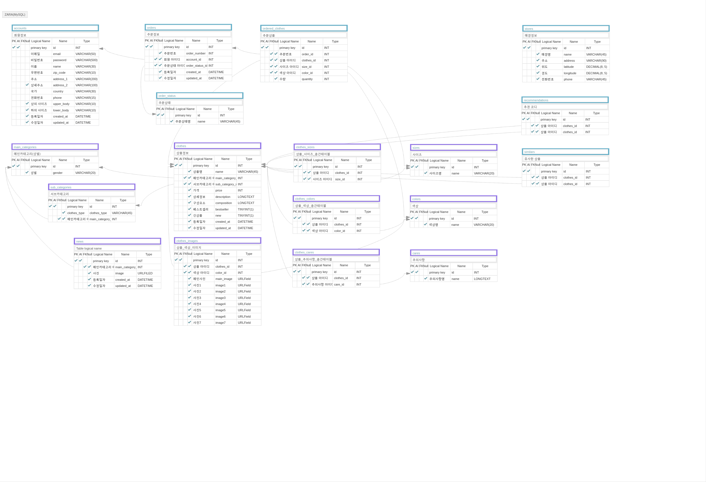

## Introduction
- [ZARA web site](https://www.zara.com/kr/) clone project
- Developed by a team of 5 developers (3 Front-End, 2 Back-End)
- [Front-End GitHub Repository](https://github.com/wecode-bootcamp-korea/we-zara-frontend)

## Demo

## Technologies
- Python
- Django web framework
- AWS EC2, RDS
- MySQL
- CORS headers

## Features
### Data
- Web Crawling : used Beautifulsoup, Selenium for dynamic web page

### Account
- Sign up : 
-used Bcrypt for user password hashing
-Email, Phone, Password Validation
- Sign in : used JWT for generating token

### Clothes
- SubCategory : return clothes list for each sub-category
- Filter list : return different filter list for each sub-category
- Filter      : return clothes list according to selected options such as color, size, price
- New         : return marketing images and new clothes list
- Detail      : return detail information for each clothes
- Search      : return clothes list which contain keyword in their name

### Order
- used Decorator for user Authorizarion
- GET    : return clothes list in cart for each user
- POST   : store ordered clothes in MySQL database
- DELETE : delete ordered clothes from MySQL database

### Store
- used latitude, longitude, haversine to find nearby stores

## API Documentation
[Endpoint API Documentation using Postman](https://documenter.getpostman.com/view/10633619/SzRw2Wfz)

## Database Modeling

